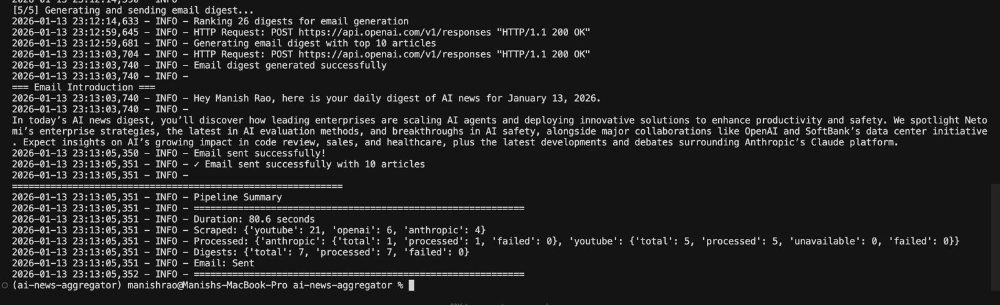

# AI News Aggregator

An intelligent, AI-powered news aggregation system that automatically scrapes, processes, and delivers personalized AI news digests via email. The system uses LLMs to summarize content, rank articles based on user preferences, and generate personalized email newsletters.

## Features

- **Multi-Source Content Scraping**
  - YouTube videos from curated AI-focused channels (with transcript extraction)
  - OpenAI official news and announcements
  - Anthropic news, research papers, and engineering blog posts

- **AI-Powered Processing**
  - Automatic content summarization using GPT-4o-mini
  - Personalized article ranking based on user profile using GPT-4.1
  - Dynamic email introduction generation

- **Personalized Delivery**
  - User profile-based content curation
  - Relevance scoring (0-10 scale) for each article
  - Beautiful HTML email digest with responsive design

- **Robust Data Management**
  - PostgreSQL database for persistent storage
  - Duplicate detection and prevention
  - Incremental processing (only processes new content)

## Architecture

```
┌─────────────────────────────────────────────────────────────────────────────┐
│                              Daily Pipeline                                  │
├─────────────────────────────────────────────────────────────────────────────┤
│                                                                              │
│  ┌─────────────┐   ┌─────────────┐   ┌─────────────┐                        │
│  │   YouTube   │   │   OpenAI    │   │  Anthropic  │                        │
│  │   Scraper   │   │   Scraper   │   │   Scraper   │                        │
│  └──────┬──────┘   └──────┬──────┘   └──────┬──────┘                        │
│         │                 │                 │                                │
│         └─────────────────┼─────────────────┘                                │
│                           ▼                                                  │
│                  ┌─────────────────┐                                         │
│                  │   PostgreSQL    │                                         │
│                  │    Database     │                                         │
│                  └────────┬────────┘                                         │
│                           │                                                  │
│         ┌─────────────────┼─────────────────┐                                │
│         ▼                 ▼                 ▼                                │
│  ┌─────────────┐   ┌─────────────┐   ┌─────────────┐                        │
│  │  Transcript │   │  Markdown   │   │   Digest    │                        │
│  │  Processor  │   │  Converter  │   │    Agent    │                        │
│  └─────────────┘   └─────────────┘   └──────┬──────┘                        │
│                                             │                                │
│                                             ▼                                │
│                                    ┌─────────────────┐                       │
│                                    │  Curator Agent  │                       │
│                                    │  (Ranking)      │                       │
│                                    └────────┬────────┘                       │
│                                             │                                │
│                                             ▼                                │
│                                    ┌─────────────────┐                       │
│                                    │   Email Agent   │                       │
│                                    │  (Generation)   │                       │
│                                    └────────┬────────┘                       │
│                                             │                                │
│                                             ▼                                │
│                                    ┌─────────────────┐                       │
│                                    │   Gmail SMTP    │                       │
│                                    │   (Delivery)    │                       │
│                                    └─────────────────┘                       │
│                                                                              │
└─────────────────────────────────────────────────────────────────────────────┘
```

## Tech Stack

| Component | Technology |
|-----------|------------|
| Language | Python 3.14+ |
| Database | PostgreSQL 17 |
| ORM | SQLAlchemy |
| LLM Provider | OpenAI (GPT-4.1, GPT-4o-mini) |
| Data Validation | Pydantic |
| RSS Parsing | feedparser |
| YouTube Transcripts | youtube-transcript-api |
| Document Conversion | Docling |
| Email | SMTP (Gmail) |
| Containerization | Docker |
| Package Manager | uv |

## Project Structure

```
ai-news-aggregator/
├── app/
│   ├── agent/                    # AI Agent modules
│   │   ├── curator_agent.py      # Article ranking based on user profile
│   │   ├── digest_agent.py       # Content summarization
│   │   └── email_agent.py        # Email introduction generation
│   ├── database/                 # Database layer
│   │   ├── connection.py         # PostgreSQL connection
│   │   ├── create_tables.py      # Schema initialization
│   │   ├── models.py             # SQLAlchemy models
│   │   └── repository.py         # Data access layer
│   ├── profiles/                 # User configuration
│   │   └── user_profile.py       # User interests and preferences
│   ├── scrapers/                 # Content scrapers
│   │   ├── anthropic.py          # Anthropic blog scraper
│   │   ├── openai.py             # OpenAI news scraper
│   │   └── youtube.py            # YouTube channel scraper
│   ├── services/                 # Business logic services
│   │   ├── email.py              # Email sending utilities
│   │   ├── process_anthropic.py  # Anthropic markdown processing
│   │   ├── process_curator.py    # Curation service
│   │   ├── process_digest.py     # Digest generation service
│   │   ├── process_email.py      # Email digest pipeline
│   │   └── process_youtube.py    # YouTube transcript processing
│   ├── config.py                 # YouTube channel configuration
│   ├── daily_runner.py           # Main pipeline orchestrator
│   └── runner.py                 # Scraper runner
├── docker/
│   └── docker-compose.yml        # PostgreSQL container config
├── main.py                       # Application entry point
├── pyproject.toml                # Project dependencies
├── uv.lock                       # Dependency lock file
└── README.md
```
## APPLICATION LOGS: 

![OUTPUT IMAGE]


![OUTPUT IMAGE2]





## FINAL EMAIL DIGEST DAILY RUNNER: 


![EMAIL_SCREENSHOT]


## Installation

### Prerequisites

- Python 3.12 or higher
- Docker and Docker Compose
- OpenAI API key
- Gmail account with App Password enabled

### 1. Clone the Repository

```bash
git clone https://github.com/yourusername/ai-news-aggregator.git
cd ai-news-aggregator
```

### 2. Install Dependencies

Using [uv](https://github.com/astral-sh/uv) (recommended):

```bash
uv sync
```

Or using pip:

```bash
pip install -e .
```

### 3. Configure Environment Variables

Create a `.env` file in the `app/` directory:

```bash
# OpenAI Configuration
OPENAI_API_KEY=your_openai_api_key_here

# PostgreSQL Configuration
POSTGRES_USER=postgres
POSTGRES_PASSWORD=postgres
POSTGRES_HOST=localhost
POSTGRES_PORT=5432
POSTGRES_DB=ai_news_aggregator

# Email Configuration (Gmail)
MY_EMAIL=your_email@gmail.com
APP_PASSWORD=your_gmail_app_password

# Optional: Proxy for YouTube Transcript API
PROXY_USERNAME=your_proxy_username
PROXY_PASSWORD=your_proxy_password
```

#### Setting Up Gmail App Password

1. Go to your Google Account settings
2. Navigate to Security → 2-Step Verification
3. At the bottom, select "App passwords"
4. Generate a new app password for "Mail"
5. Use this 16-character password as `APP_PASSWORD`

### 4. Start the Database

```bash
cd docker
docker-compose up -d
```

### 5. Initialize Database Tables

```bash
python -m app.database.create_tables
```

## Usage

### Run the Full Pipeline

Execute the complete daily pipeline that scrapes, processes, and sends an email digest:

```bash
python main.py
```

With custom parameters:

```bash
# Scrape articles from the last 168 hours (7 days), include top 10 in email
python main.py 168 10
```

### Pipeline Stages

The daily pipeline executes 5 stages:

1. **Scraping** - Fetches new content from all sources
2. **Anthropic Processing** - Converts Anthropic articles to markdown
3. **YouTube Processing** - Extracts video transcripts
4. **Digest Generation** - Creates AI summaries for all new content
5. **Email Delivery** - Ranks articles and sends personalized email

### Run Individual Components

```bash
# Run scrapers only
python -m app.runner

# Process Anthropic articles
python -m app.services.process_anthropic

# Process YouTube transcripts
python -m app.services.process_youtube

# Generate digests
python -m app.services.process_digest

# Send email digest
python -m app.services.process_email
```

## Configuration

### YouTube Channels

Edit `app/config.py` to customize the list of YouTube channels to monitor:

```python
YOUTUBE_CHANNELS = [
    "UCNF0LEQ2abMr0PAX3cfkAMg",  # AI Explained
    "UCJIfeSCssxSC_Dhc5s7woww",  # Matt Wolfe
    "UCSHZKyawb77ixDdsGog4iWA",  # Lex Fridman
    "UCsBjURrPoezykLs9EqgamOA",  # Fireship
    "UCbfYPyITQ-7l4upoX8nvctg",  # Two Minute Papers
    # Add more channel IDs...
]
```

To find a YouTube channel ID:
1. Go to the channel page
2. View page source
3. Search for `channelId` or `externalId`

### User Profile

Customize your interests and preferences in `app/profiles/user_profile.py`:

```python
USER_PROFILE = {
    "name": "Your Name",
    "title": "Your Title",
    "background": "Your professional background",
    "interests": [
        "Large Language Models (LLMs)",
        "AI agent architectures",
        "Production AI systems",
        # Add your interests...
    ],
    "preferences": {
        "prefer_practical": True,
        "prefer_technical_depth": True,
        "prefer_research_breakthroughs": True,
        "prefer_production_focus": True,
        "avoid_marketing_hype": True
    },
    "expertise_level": "Advanced"  # Beginner, Intermediate, Advanced
}
```

## Database Schema

### Tables

| Table | Description |
|-------|-------------|
| `youtube_videos` | Stored YouTube videos with transcripts |
| `openai_articles` | OpenAI news articles |
| `anthropic_articles` | Anthropic blog posts with markdown content |
| `digests` | AI-generated summaries of all content |

### Entity Relationships

```
YouTubeVideo    ──┐
                  │
OpenAIArticle   ──┼──► Digest (1:1)
                  │
AnthropicArticle──┘
```

## AI Agents

### DigestAgent

Generates concise summaries of articles and videos using GPT-4o-mini.

**Capabilities:**
- Creates compelling 5-10 word titles
- Writes 2-3 sentence summaries highlighting key points
- Focuses on actionable insights and implications

### CuratorAgent

Ranks articles based on user profile relevance using GPT-4.1.

**Scoring Criteria:**
- 9.0-10.0: Highly relevant, directly aligns with interests
- 7.0-8.9: Very relevant, strong alignment
- 5.0-6.9: Moderately relevant
- 3.0-4.9: Somewhat relevant
- 0.0-2.9: Low relevance

### EmailAgent

Generates personalized email introductions using GPT-4.1.

**Features:**
- Personalized greeting with user's name
- Date-aware introductions
- Overview of top-ranked articles
- Theme highlighting

## Email Output

The system generates beautifully formatted HTML emails with:

- Personalized greeting and date
- Curated introduction summarizing top articles
- Each article with title, summary, and link
- Clean, responsive design

Example email structure:

```
Hey [Name], here is your daily digest of AI news for January 13, 2026.

[Introduction highlighting key themes]

---

## Article Title 1
[2-3 sentence summary]
[Read more →]

---

## Article Title 2
[2-3 sentence summary]
[Read more →]

...
```

## Scheduling (Recommended)

Set up a daily cron job to run the pipeline automatically:

```bash
# Edit crontab
crontab -e

# Add this line to run daily at 8:00 AM
0 8 * * * cd /path/to/ai-news-aggregator && /path/to/python main.py >> /var/log/ai-news.log 2>&1
```

## Troubleshooting

### Common Issues

**Database Connection Failed**
```bash
# Ensure PostgreSQL container is running
docker ps
docker-compose up -d
```

**YouTube Transcript Unavailable**
- Some videos don't have transcripts available
- Consider using a proxy if rate-limited

**Email Not Sending**
- Verify `APP_PASSWORD` is a valid Gmail App Password
- Ensure 2-Step Verification is enabled on Gmail
- Check spam folder

**No Articles Found**
```bash
# Increase the time window
python main.py 336 10  # Last 14 days
```

### Logs

The pipeline provides detailed logging:

```
2026-01-13 08:00:00 - INFO - Starting Daily AI News Aggregator Pipeline
2026-01-13 08:00:01 - INFO - [1/5] Scraping articles from sources...
2026-01-13 08:00:15 - INFO - ✓ Scraped 5 YouTube videos, 2 OpenAI articles, 3 Anthropic articles
...
```

## Dependencies

| Package | Version | Purpose |
|---------|---------|---------|
| beautifulsoup4 | ≥4.14.2 | HTML parsing |
| docling | ≥2.61.2 | Document conversion |
| feedparser | ≥6.0.12 | RSS feed parsing |
| markdown | ≥3.7.0 | Markdown to HTML |
| markdownify | ≥0.11.6 | HTML to Markdown |
| openai | ≥2.7.2 | LLM API client |
| psycopg2-binary | ≥2.9.11 | PostgreSQL adapter |
| pydantic | ≥2.12.5 | Data validation |
| python-dotenv | ≥1.2.1 | Environment management |
| requests | ≥2.32.5 | HTTP client |
| sqlalchemy | ≥2.0.44 | ORM |
| youtube-transcript-api | ≥1.2.3 | YouTube transcripts |

## Contributing

1. Fork the repository
2. Create a feature branch (`git checkout -b feature/amazing-feature`)
3. Commit your changes (`git commit -m 'Add amazing feature'`)
4. Push to the branch (`git push origin feature/amazing-feature`)
5. Open a Pull Request


## Acknowledgments

- [OpenAI](https://openai.com) for GPT models
- [Anthropic](https://anthropic.com) for research content
- YouTube creators in the AI space
- [Docling](https://github.com/DS4SD/docling) for document conversion
